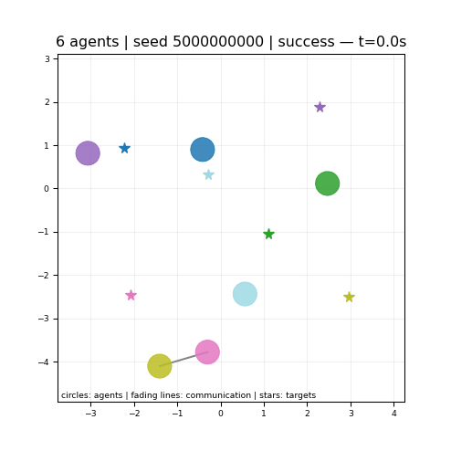
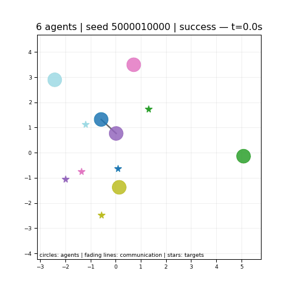
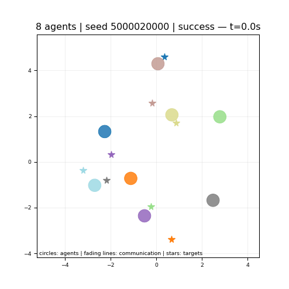
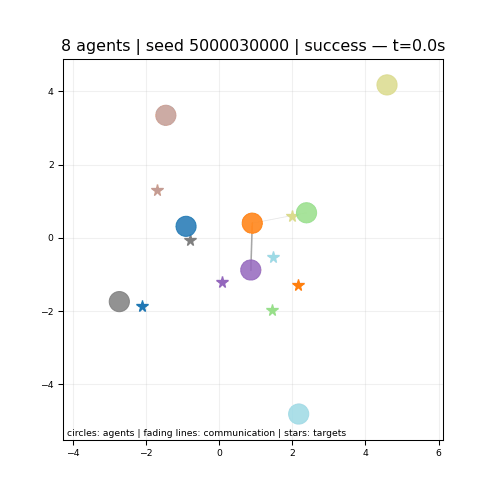
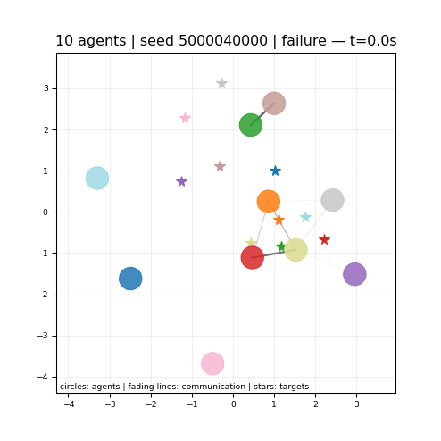
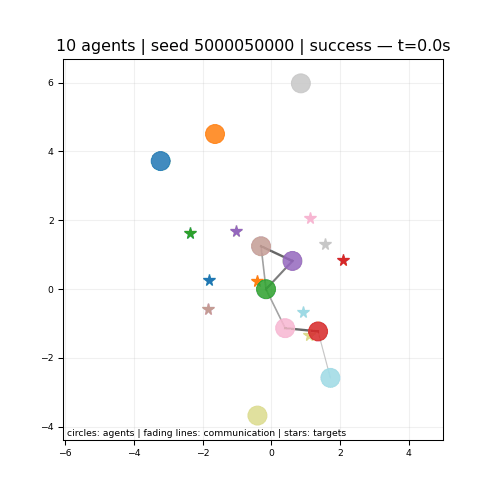
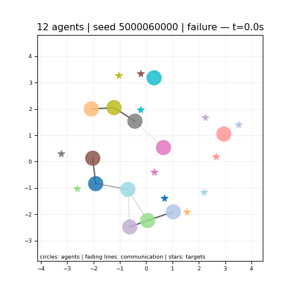
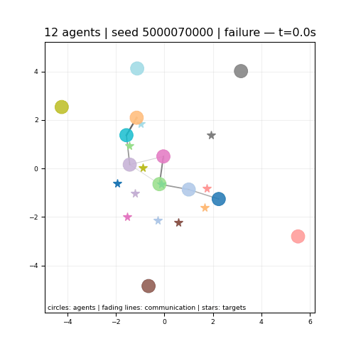

# GNN-MAD multi-agent target swapping

This repository trains and evaluates a deterministic GNN-MAD policy for damped
point-mass agents moving in the plane. Each agent has a fixed target and must
reach it without colliding with other agents. The examples vary the number of
agents and the assignment of initial positions to targets.

## Policy

Each agent communicates with neighbors within a fixed radius. The communication
graph changes as the agents move. All agents share the same GNN parameters,
so the same policy can control different numbers of agents.

The control combines a proportional target controller with a learned correction
formed by multiplying a scalar magnitude and a bounded direction. One GNN
computes the direction from current local observations. A second GNN uses the
initial positions, velocities, fixed targets, and graph to initialize a stable
linear recurrent unit (LRU), whose output supplies the signed magnitude.

The LRU receives no further input. Its eigenvalues lie strictly inside the unit
disk, so the magnitude and learned correction converge to zero, recovering the
proportional controller asymptotically. This decay need not be monotonic and does
not guarantee collision avoidance. The deployed controller uses no global state,
collision-avoidance teacher, or safety filter.

## Run

Install the reference environment from the repository root:

```bash
conda create -n swapping-gnn-mad python=3.10.18
conda activate swapping-gnn-mad
python -m pip install -r requirements-reference.txt
python -m pip install -e . --no-deps
make check-release
```

Evaluate the included model, compute sampled separation metrics, or render the
predefined examples:

```bash
make evaluate
make analyze
make gifs
```

Outputs are written under `runs/`. Evaluation and analysis require fresh output
paths. The same [trained weights](artifacts/model.pt) are used for every example
and agent count. Detailed evaluation records are stored in [results/](results/).

## Train from scratch

```bash
make from-scratch
```

The [recipe](configs/from_scratch_recipe.json) trains from random weights using
teacher imitation, policy trajectories, and episode replay. Each stage starts
from the preceding stage's best validation checkpoint. The command verifies
reference hashes, evaluates the selected model, and renders the examples.
Training settings are defined in the recipe and
[configuration](configs/train_random.yaml).

Outputs go to `runs/from_scratch/`; existing training folders are not overwritten.
Full reproduction was previously verified in the pinned CPU environment.
Cross-platform bitwise identity is not guaranteed. To run without requiring
identical reference hashes:

```bash
PYTHONPATH=src python scripts/train_from_scratch.py --output-dir runs/new_run
```

`make from-scratch-smoke` checks the training pipeline with a short run.
`make test` includes training repeatability tests; `make check-release` checks
artifacts, evaluation, and gradient propagation without training.

## Examples

All predefined examples are shown, including failures. Stars mark targets,
circles mark agents, lines show communication links, and red outlines indicate
sampled separation violations. The animations retain real-time playback.
Seeds and outcomes are recorded in the [manifest](artifacts/gifs/manifest.json).



6 agents · random targets · success.



6 agents · mixed clutter · success.



8 agents · random targets · success.



8 agents · mixed clutter · success.



10 agents · random targets · collision failure.



10 agents · mixed clutter · success.



12 agents · random targets · collision failure.



12 agents · mixed clutter · collision failure.
